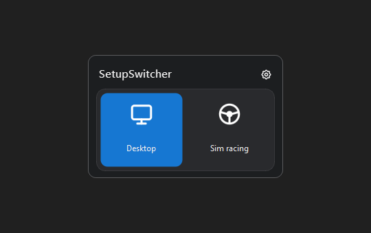

# SetupSwitcher

A small Windows utility for switching your complete desktop setup with one
click: primary display, audio output, and microphone.

**Works with NVIDIA Surround.** Surround layouts exposed by the NVIDIA driver
are detected as a display and can be assigned to either profile.



## Key features

- NVIDIA Surround compatible;
- two customizable setup profiles;
- one-click display and audio switching;
- compact system-tray panel;
- global `Ctrl+Alt+S` shortcut;
- configurable monitor, speakers, microphone, and profile color;
- optional startup with Windows.

## Run

```powershell
python run_switcher.py
```

## Rebuild the UI demo

```powershell
make gif
```

This refreshes the screenshots in `images`, builds `demo.gif`, and exits.

## Tests

```powershell
make test
```
